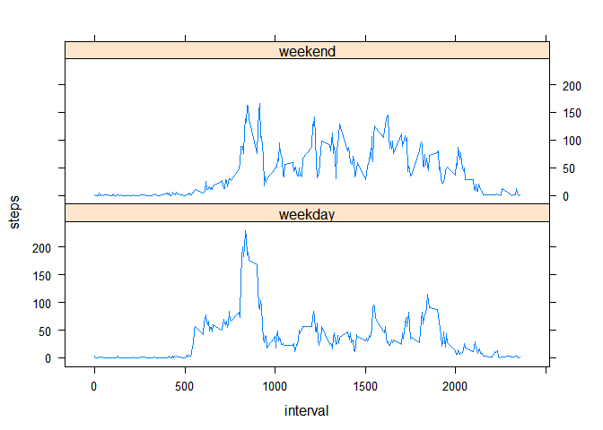

## Loading and preprocessing the data

```r
## load R libraries used in the project
library(lattice)

file_url <- "https://d396qusza40orc.cloudfront.net/repdata%2Fdata%2Factivity.zip"
file_name <- "activity.zip"

# download and load data, if needed
if (!exists("activity")) {
        if (!file.exists(file_name)) {
                download.file(file_url, file_name, mode ="wb")
        }
        activity <- read.csv(unz(file_name, "activity.csv"), na.strings = "NA", 
                             stringsAsFactors = FALSE)
}        
# assert data size
stopifnot(nrow(activity) == 17568)

# convert "date" column variables to Date type
activity$date <- as.Date(activity$date, format = "%Y-%m-%d")

head(activity)
```

```
##   steps       date interval
## 1    NA 2012-10-01        0
## 2    NA 2012-10-01        5
## 3    NA 2012-10-01       10
## 4    NA 2012-10-01       15
## 5    NA 2012-10-01       20
## 6    NA 2012-10-01       25
```

## What is mean total number of steps taken per day?

```r
# calculate total number of steps taken each day
steps_per_day <- aggregate(steps ~ date, activity, FUN = sum, na.rm = TRUE)

# create a histogram 
with(steps_per_day, hist(steps, xlab = "Steps", 
                         main = "Total number of steps taken per day"))
```

<!-- -->

```r
# calculate the mean and median of the total number of steps taken per day (without NAs)
steps_per_day_mean = round(mean(steps_per_day$steps), 2)
steps_per_day_median = round(median(steps_per_day$steps), 2)
steps_per_day_mean
```

```
## [1] 10766.19
```

```r
steps_per_day_median
```

```
## [1] 10765
```

*Mean total number of steps taken per day: __10766.19__*  
*Median total number of steps taken per day: __10765__*

## What is the average daily activity pattern?

```r
# calculate total number of steps taken during each 5-min interval of day
steps_per_activity <- aggregate(steps ~ interval, activity, FUN = mean, na.rm = TRUE)

# create a time series plot
with(steps_per_activity, plot(interval, steps,
                         type = "l",     
                         xlab = "5-min time interval", 
                         ylab = "Steps",
                         main = "Avarage number of steps taken per 5-min activity")
     )
```

<!-- -->

```r
# calculate the interval with the max number of steps averaged accross all the days
max_steps = which.max(steps_per_activity$steps)
max_steps
```

```
## [1] 104
```

```r
max_interval = steps_per_activity[max_steps,]$interval
max_interval
```

```
## [1] 835
```
*The 5-minute interval that, on average across all the days in the dataset, contains the maximum number of steps (__104__ steps)*  
*is interval number __835__*

## Imputing missing values


```r
sum(is.na(activity$steps))
```

```
## [1] 2304
```

*The total number of missing values in the dataset is __2304__*  

Missing steps values will be replaces with mean values for the corresponding 5-minute interval.


```r
# copy activity into a new dataset
activity_imputed <- activity

# replace missing steps values in the new dataset by using average steps values 
# for the corresponding 5-min intervals
activity_imputed$steps <- ifelse(is.na(activity$steps), steps_per_activity$steps[steps_per_activity$interval %in% activity$interval], activity$steps)

# calculate total number of steps taken each day for the new dataset
steps_per_day_imp <- aggregate(steps ~ date, activity_imputed, FUN = sum)

# create a histogram 
with(steps_per_day_imp, hist(steps, xlab = "Steps", 
                         main = "Total number of steps taken per day, after imputing missing  values"))
```

<!-- -->

```r
# calculate the mean and median of the total number of steps taken per day
steps_per_day_imp_mean = round(mean(steps_per_day_imp$steps), 2)
steps_per_day_imp_median = round(median(steps_per_day_imp$steps), 2)
steps_per_day_imp_mean
```

```
## [1] 10766.19
```

```r
steps_per_day_imp_median
```

```
## [1] 10766.19
```

*Mean total number of steps taken per day, after imputing missing values: __10766.19__*  
*Median total number of steps taken per day, after imputing missing values: __10766.19__*

**After imputing missing step value, mean total number of steps taken per day remained the same.**  
**Median total number of steps slightly increased and became equal to the mean total number of steps.**  
**The histogram shape changed insignificantly. **

## Are there differences in activity patterns between weekdays and weekends?


```r
## create a new factor variable in the dataset with two levels - "weekday" and "weekend" 
weekend = c("Saturday", "Sunday")
activity_imputed$weekdays <- as.factor(ifelse(weekdays(activity_imputed$date) %in% weekend,"weekend", "weekday"))

# calculate total number of steps taken during each 5-min interval of day
steps_per_activity_imp <- aggregate(steps ~ interval + weekdays, activity_imputed, FUN = mean)

# create a panel plot containing a time series plot
with(steps_per_activity_imp, xyplot(steps ~ interval | weekdays, type = "l", layout=c(1,2)))
```

<!-- -->
